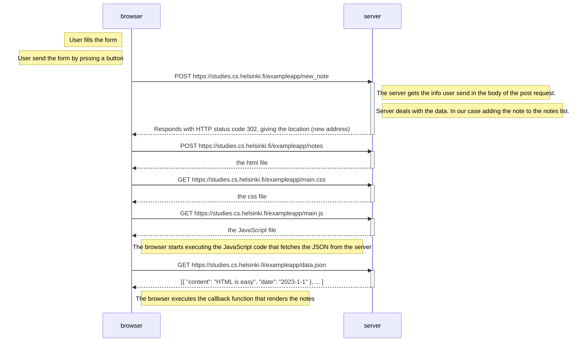

## User sending a new note 

```mermaid
sequenceDiagram

    participant browser
    participant server

    
    Note left of browser: User fills the form
    Note left of browser: User send the form by prssing a button

    browser->>server: POST https://studies.cs.helsinki.fi/exampleapp/new_note
    activate server
    Note right of server: The server gets the info user send in the body of the post request.
    Note right of server: Server deals with the data. In our case adding the note to the notes list.
    server-->>browser: Responds with HTTP status code 302, giving the location (new address)
    deactivate server

    browser->>server: POST https://studies.cs.helsinki.fi/exampleapp/notes
    activate server
    server-->>browser: the html file
    deactivate server

    browser->>server: GET https://studies.cs.helsinki.fi/exampleapp/main.css
    activate server
    server-->>browser: the css file
    deactivate server

    browser->>server: GET https://studies.cs.helsinki.fi/exampleapp/main.js
    activate server
    server-->>browser: the JavaScript file
    deactivate server

    Note right of browser: The browser starts executing the JavaScript code that fetches the JSON from the server

    browser->>server: GET https://studies.cs.helsinki.fi/exampleapp/data.json
    activate server
    server-->>browser: [{ "content": "HTML is easy", "date": "2023-1-1" }, ... ]
    deactivate server

    Note right of browser: The browser executes the callback function that renders the notes
```