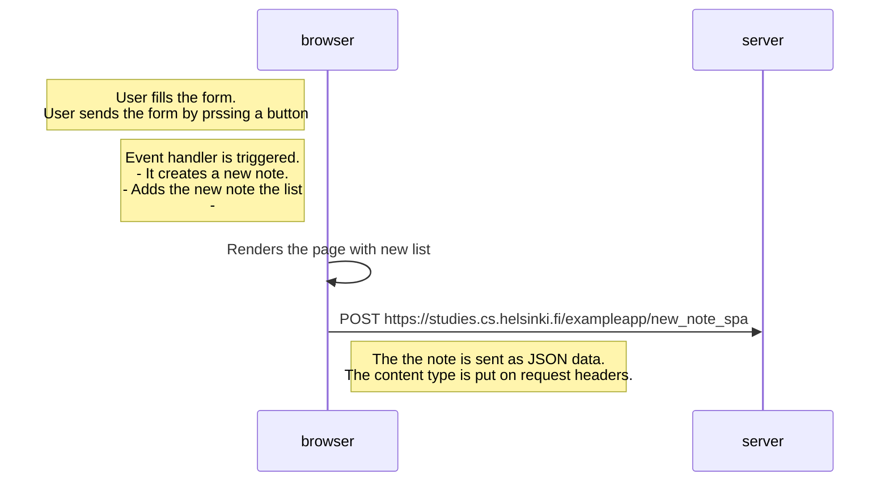

## Adding a new note with tthe SPA version of the application

```mermaid
sequenceDiagram

    participant browser
    participant server


    Note left of browser: User fills the form. <br> User sends the form by prssing a button

    Note left of browser: Event handler is triggered. <br> - It creates a new note. <br> - Adds the new note the list <br> - 
    
    
    browser->>browser: Renders the page with new list
    
    browser->>server: POST https://studies.cs.helsinki.fi/exampleapp/new_note_spa
    Note right of browser: The the note is sent as JSON data. <br> The content type is put on request headers.


```